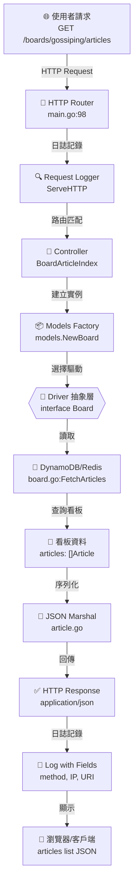
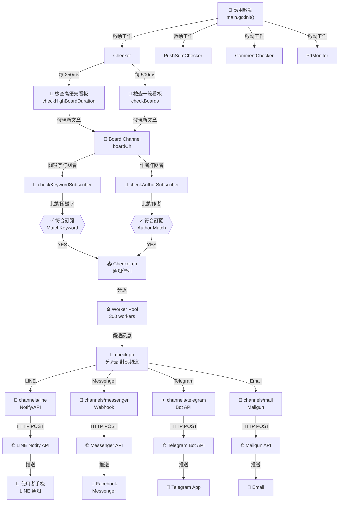
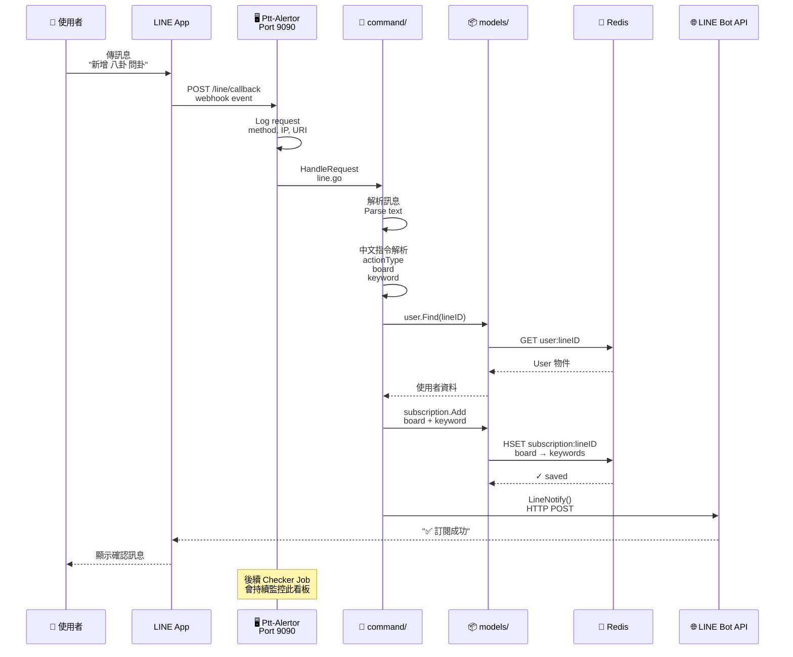
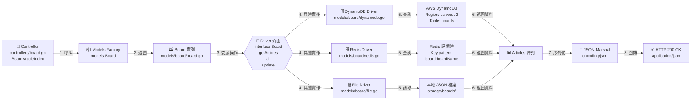
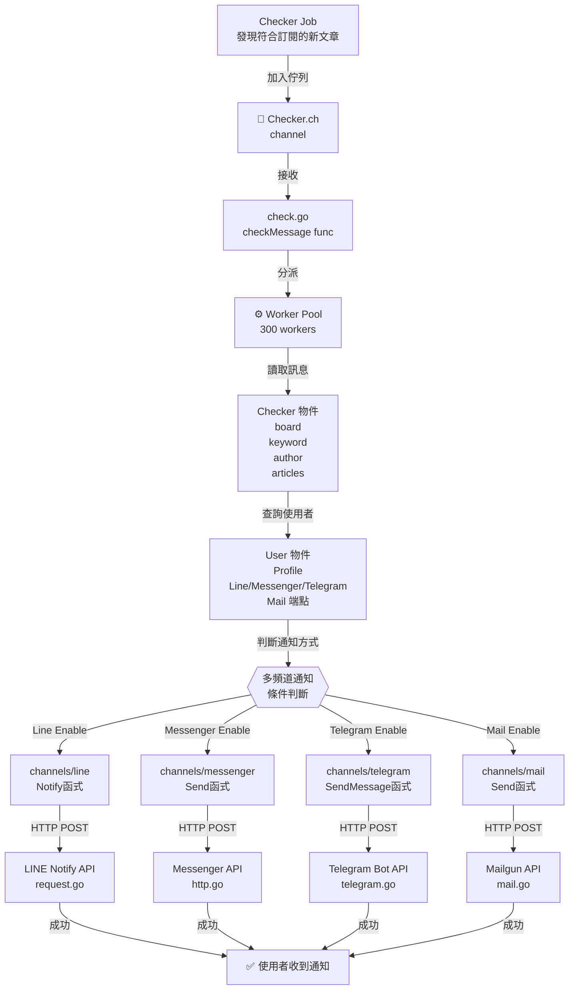
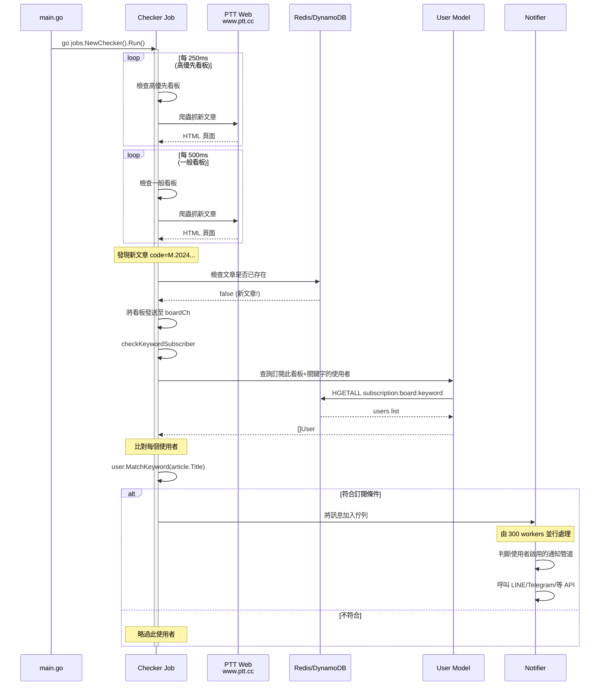
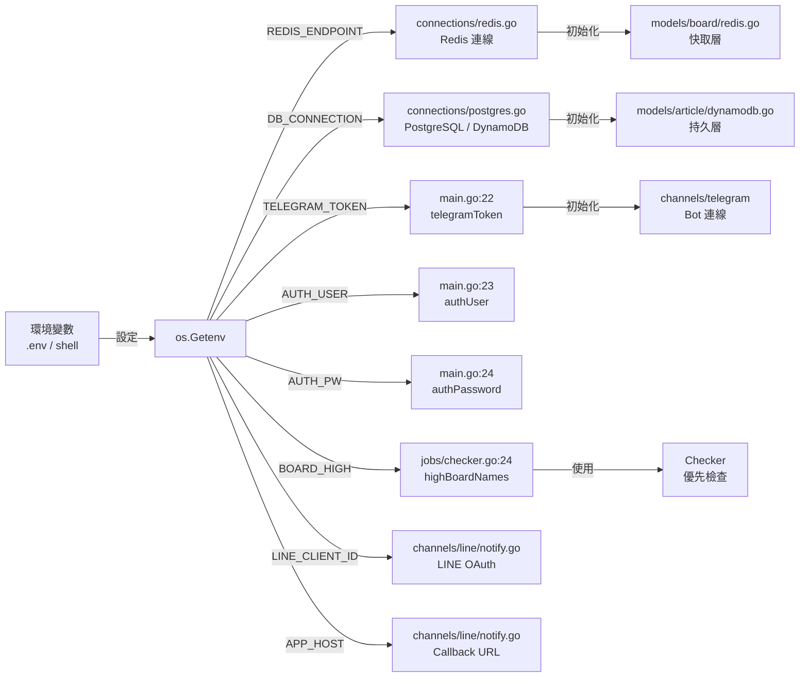

# PTT-Alertor 請求流程圖

## 📍 場景：使用者查詢看板文章
**GET /boards/gossiping/articles**



---

## 📍 場景：後台監控新文章並發送通知
**背景工作流程**



---

## 📍 場景：使用者透過 LINE Bot 新增訂閱
**POST /line/callback**



---

## 📍 詳細：Controller → Models → Driver 流程



---

## 📍 資料流：Article Model 的 Driver 抽象

```mermaid
graph TD
    A["Article 結構體<br/>article.go<br/>id, code, title, link<br/>author, board, pushSum"] -->|包含| B["🔀 Driver 介面<br/>interface Driver<br/>Find<br/>Save<br/>Delete"]
    
    B -->|實作選項| C1["DynamoDB 驅動<br/>models/article/dynamodb.go<br/>AWS SDK"]
    B -->|實作選項| C2["Redis 驅動<br/>models/article/redis.go<br/>Redigo"]
    
    C1 -->|DynamoDB 特性| D1["✓ 分散式<br/>✓ 高可用<br/>✓ 成本較高<br/>✗ 啟動複雜"]
    
    C2 -->|Redis 特性| D2["✓ 超快速<br/>✓ 無須設定<br/>✗ 記憶體有限<br/>✗ 斷電遺失"]
    
    Note over B: 透過 Factory 模式<br/>models/models.go<br/>自動選擇驅動實作
```

---

## 📍 通知發送佇列系統



---

## 📍 HTTP 請求完整生命週期

```mermaid
graph TD
    A["🌐 CLIENT<br/>GET /boards/gossiping/articles"] -->|TCP 連線| B["🖥️ HTTP Server<br/>Port 9090"]
    
    B -->|1. 接收| C["myRouter.ServeHTTP<br/>main.go:30"]
    
    C -->|2. 日誌| D["log.WithFields<br/>method, IP, URI"]
    
    D -->|3. 路由查詢| E["httprouter<br/>julienschmidt/httprouter"]
    
    E -->|4. 找到| F["GET /boards/:boardName/articles<br/>→ BoardArticleIndex"]
    
    F -->|5. 執行| G["func BoardArticleIndex<br/>controllers/board.go"]
    
    G -->|6. 建立| H["models.Board<br/>factory pattern"]
    
    H -->|7. 設定參數| I["bd.Name = GOSSIPING"]
    
    I -->|8. 呼叫| J["bd.FetchArticles"]
    
    J -->|9. 呼叫 Driver| K["DynamoDB / Redis<br/>實作"]
    
    K -->|10. 查詢| L["資料庫<br/>articles table"]
    
    L -->|11. 返回| M["article.Articles<br/>[]Article"]
    
    M -->|12. 序列化| N["json.Marshal<br/>encoding/json"]
    
    N -->|13. 寫入| O["http.ResponseWriter<br/>w"]
    
    O -->|14. 發送| P["HTTP 200 OK<br/>Content-Type: application/json"]
    
    P -->|TCP| Q["🌐 CLIENT<br/>收到 JSON 回應"]
    
    Q -->|渲染| R["瀏覽器/App<br/>展示文章列表"]
```



---

## 📍 時序圖：背景監控工作



---

## 📍 環境變數 → 程式碼對應



---

## 🎯 核心設計模式

### 1. **Driver 抽象層 (Strategy Pattern)**
```go
// 介面定義
type Driver interface {
    Find(code string, article *Article)
    Save(a Article) error
    Delete(code string) error
}

// 多個實作
- article.DynamoDB (implements Driver)
- article.Redis (implements Driver)

// Factory 建立
var Article = func() *article.Article {
    return article.NewArticle(new(article.DynamoDB))
}
```

### 2. **工作佇列 (Producer-Consumer Pattern)**
- **Producer**: Checker job 發現新文章
- **Channel**: `boardCh`, `Checker.ch`
- **Consumer**: Worker pool (300 workers)

### 3. **中文指令解析 (Command Pattern)**
- 使用者輸入: `"新增 八卦 問卦"`
- Parser: 解析關鍵字、看板、指令類型
- Executor: 執行訂閱操作

---

## 📊 資料流向摘要

```
Client 請求
  ↓
HTTP Router (main.go)
  ↓
Controller (controllers/)
  ↓
Models Factory (models/models.go)
  ↓
Driver 介面 (interface)
  ↓
具體實作 (DynamoDB/Redis/File)
  ↓
外部服務 (AWS/Redis/Local)
  ↓
HTTP 回應
```

---

## 🔄 背景工作監控流程

```
↓ 應用啟動 ↓
  │
  ├─→ Checker (檢查新文章)
  │    ├─ High Priority Boards (每 250ms)
  │    └─ Normal Boards (每 500ms)
  │
  ├─→ PushSumChecker (監控推文數)
  │
  ├─→ CommentChecker (監控新推文)
  │
  ├─→ PttMonitor (監控看板狀態)
  │
  └─→ Cron Jobs
       ├─ Top (每小時)
       └─ PushSumKeyReplacer (每 48 小時)

      ↓ 發現符合訂閱的文章 ↓
          │
          ├─ 比對關鍵字
          ├─ 比對作者
          └─ 比對推文數門檻
              ↓
          符合 → 加入通知佇列
              ↓
          Worker Pool (300 workers)
              ↓
          選擇通知管道 (LINE/Telegram/Messenger/Mail)
              ↓
          呼叫外部 API
              ↓
          使用者收到通知
```

